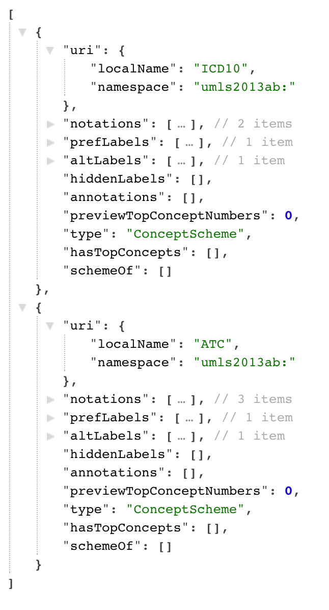

# SKOSI version `1.0` (neandertal)
[GO Back Home](index.md)
## REST Services
SKOSI provides REST services , with JSON data as results.
2 kinds of JSON data are exposed.

* JSON-LD : return some SKOS RDF triples.
* JSON	: return some SKOS Object-Oriented.

### 1. JSON-LD Rest Services
*to be done.* 
### 2. JSON Rest Services
#### 2.1 Data Model
The Data Model is an java implementation of SKOS entities and their relations.
Download the java implementation of SKOS used in SKOSI. 
(skosimpl)

#### 2.2 Rest URL Structure
All services are based on : 

* **'Domain of Server':'Port'**		
	* ex : **http://localhost:8080** 
	* *Acronym used in this doc : `domain`*

* **Application Name.**	
	* ex : **skosi-demo** 
	* *Acronym used in this doc : `skosi`* 
* **Resource Id** (URL encoded)
	* ex : **test[1415003529893**]
	* *Acronym in this doc : `test`* 

real example with URL encoded caracters for resource ID :

```
http://localhost:8080/skosi-demo/[......]/SNOMED-CT%5B1415178655232%5D
```

#### 2.3 Query Services
basic URL  : domain/skosi/**services/rest/query**/test/

2.3.1 schemes

Goal : provide an array of the ConceptSchemes entities from the resource.

URL : domain/app/services/rest/query/test/**schemes?format=json**

Path  = **schemes**

Query Parameters :

 * format (format=json) (Required)
 
Notes : These ConceptScheme objects only contain information about :

* SKOS Lexical Labels. ([ref](http://www.w3.org/TR/skos-reference/#labels))
* SKOS Notations ([ref](http://www.w3.org/TR/skos-reference/#notations))
* SKOS Documentation Properties([ref](http://www.w3.org/TR/skos-reference/#notes))

SKOSI Viewer Example :    




